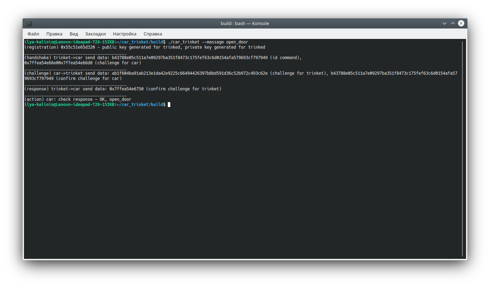
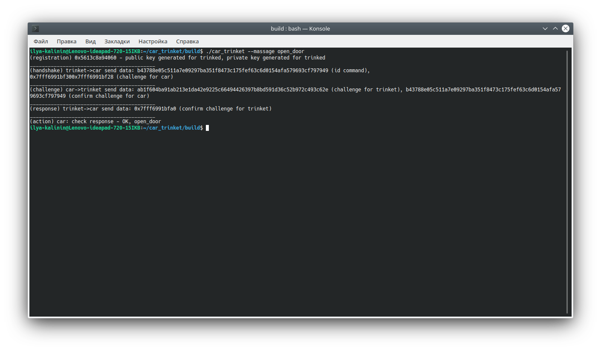

# Назначение

В данном репозитории хранится второе задание
по дицсиплине Разработчик криптографических протоколов
и децентраоизованных систем

# Описание

Программа эмулирует работу автомобильного брелока, открывающего машину, с использованием ЭЦП в условиях, когда канал связи полностью доступен любому прослушивающему (в том числе и в течение большого времени и попыток), а также атакующий может повторить прослушанные данные.

# Использование

1. Клонируйте данный репозиторий на свою машину.

2. Запустите `mkdir build && cd build` для создания директории сборки.

3. Запустите `cmake ..` для создания файлов сборки.

4. Запустите `make` для сборки

5. Запустите команду в формате "./car_trinket --massage <massage_to_car>
где: <massage_to_car> - сообщение, передаваемое по каналу связи.

## Примечания к запуску

Заранее собранный проект лежит в репозитории, возможно перейти по `cd build`. Допускается сразу перейти к пункту использования "5".

Ключи и данные динамически генерируются в файлах, с которыми можно ознакомиться.

# Примеры работы программы

​

​

​
    
# Авторы и права на использование

Автор: Калинин Илья

Файлы, содержащиеся в данном репозитории, являются общественным достоянием
и могут использоваться, модифицироваться и распространяться без ограничений.

# Связь

Замечания можно присылать на адрес <kalinin.abs@gmail.com> или в telegram @mozabs
